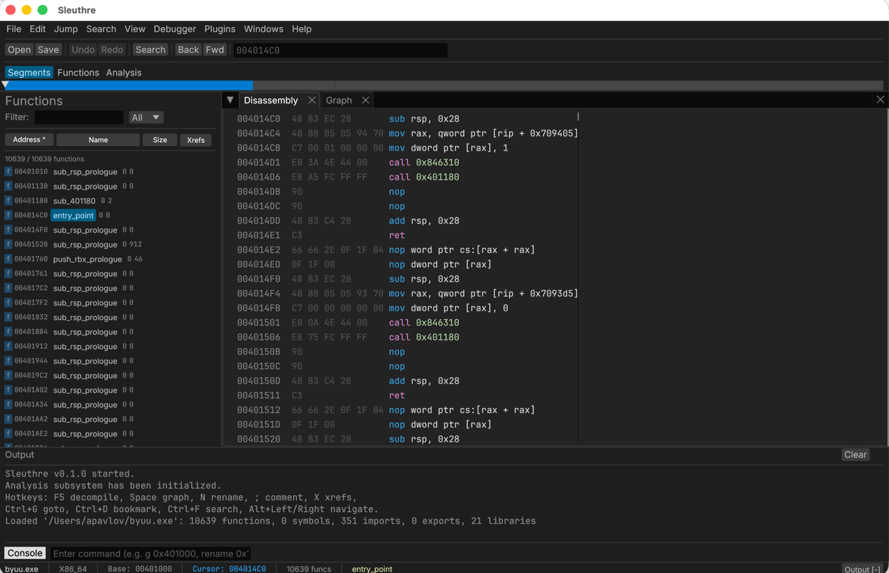

# sleuthre

[](https://github.com/kidoz/sleuthre/releases/latest)
[](LICENSE)
[](https://www.rust-lang.org/)

An open-source reverse engineering desktop application built in Rust.



## Features

### Analysis engine
- **Loaders** — ELF, PE, Mach-O (single + fat), raw binary; archive/image/bytecode plugin formats
- **Architectures** — x86, x86-64, ARM, ARM64, ARM Thumb-2, MIPS, MIPS64, RISC-V (RV32/RV64) via Capstone
- **Function discovery** — entry-point + recursive descent + prologue heuristics
- **Control flow graphs** — basic-block recovery, switch-table reconstruction, layered layout
- **Cross-references** — bidirectional indexes for calls/jumps/data/string refs
- **Strings + constants** — ASCII / UTF-16LE / UTF-16BE; CRC32 / AES S-box / pointer tables
- **MSVC pattern recognition** — SEH frame setup, FPO prologues, inline `rep movs/stos`
- **VTable recovery** — auto-link discovered vtables to declared C++ classes; resolve `obj->Method()` in decompiled output
- **Type intelligence** — DWARF + PDB parsers, Win32 / DirectX / libc type libraries, struct inference

### Decompiler
- **Compilable C output** — typed dereferences, function-pointer casts on indirect calls, SSE/AVX intrinsic calls instead of placeholders, switch-default `break;`, return-type fall-through guard. The emitted text passes `cc -fsyntax-only -std=c11` (verified by integration test).
- **Recompile-diff** — `analysis::recompile_diff` writes the decomp output to a temp `.c`, runs `cc -c`, disassembles the result, and reports per-category instruction divergence vs. the original. Closes the loop on "did the decompilation preserve semantics?" — no commercial RE tool ships this.
- **Surgical cache invalidation** — annotation-driven dependency graph invalidates only the affected functions on a rename or type edit; full clears are gone.

### Collaboration & automation
- **Live broadcast collab** — TCP listener publishes every `UndoCommand` as line-delimited JSON; viewers can also send events back (bidirectional). Tools menu exposes start/stop.
- **Git-friendly project format** — `Project::export_jsonl` emits deterministic JSON-Lines for renames/comments/bookmarks/tags/overlays/types; `merge_jsonl_3way` performs a semantic 3-way merge with conflict markers for async PR-based RE.
- **MCP server** — first-party Model Context Protocol implementation with 27 typed tools (disasm, decomp, MLIL/SSA dumps, IL rewrite, recompile-diff, JSONL merge, signature scans, …) and 7 resources for AI agent integration. No other RE tool ships this natively.
- **Plugins** — Rhai scripts hot-reloaded from `~/.sleuthre/plugins/`; async worker thread runs scripts without blocking the UI; FLIRT PAT importer for community signature corpora.
- **GDB Remote Serial Protocol debugger** — connects to gdbserver / QEMU-gdbstub / LLDB platform via `GdbRemoteDebugger`; attach / step / continue / read registers + memory.
- **AI approval queue** — review and approve AI-suggested renames and comments before they apply.

### Project persistence
- SQLite-backed (`*.sleuthre`) with full round-trip for functions, comments, xrefs, strings, types, classes, struct overlays, bookmarks, tags, and decompilation cache.

## Architecture

The project is a Cargo workspace with three crates:

| Crate | Description |
|-------|-------------|
| **re-core** | Analysis engine — binary loaders, disassembly, CFG, cross-references, string/constant detection, decompiler, SQLite project database |
| **re-gui** | Desktop UI built with egui/eframe — disassembly, graph, hex, strings, and pseudocode views |
| **re-mcp** | Headless MCP server (JSON-RPC over stdio) for AI agent integration |
| **re-cli** | Headless CLI tool for batch binary analysis |

## Building

```sh
cargo build
```

## Running

```sh
# Desktop GUI
cargo run -p re-gui

# MCP server (JSON-RPC over stdio)
cargo run -p re-mcp

# CLI batch analysis
cargo run -p re-cli -- --help
```

## Testing

```sh
cargo test
```

## Linting & Formatting

```sh
cargo clippy -- -D warnings
cargo fmt --check
```

## GUI

The desktop UI provides:

- **Disassembly view** — address, bytes, mnemonic, operands with inline comments
- **Graph view** — control flow graph with Bezier curve edges and back-edge highlighting
- **Hex view** — traditional hex dump with ASCII column
- **Strings view** — filterable string table with encoding and length info
- **Pseudocode view** — decompiled C-style output
- **Functions panel** — searchable function list with jump-to navigation
- **Navigation band** — visual memory map with color-coded segments

### Keyboard shortcuts

| Key | Action |
|-----|--------|
| `F5` | Decompile current function |
| `Space` | Show control flow graph |
| `N` | Rename symbol at cursor |
| `;` | Add/edit comment at cursor |
| `X` | Show cross-references |

## MCP Server

The MCP server exposes tools for AI agents to interact with a loaded binary:

| Tool | Description |
|------|-------------|
| `open_binary` | Load an ELF/PE binary for analysis |
| `get_disasm` | Get disassembly listing at an address |
| `get_xrefs` | Get cross-references (to/from/both) |
| `get_cfg` | Get control flow graph for a function |
| `get_strings` | Get discovered strings (with filter) |
| `submit_rename` | Propose a function rename (requires approval) |
| `add_comment` | Add or remove a comment at an address |
| `save_project` | Save the current project to a file |

Resources are available at `sleuthre://project/{functions,strings,xrefs,comments}`.

## License

Licensed under the [MIT License](LICENSE).
